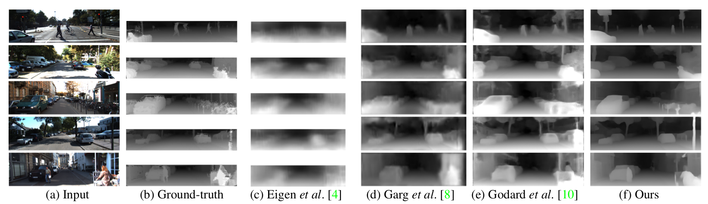

# LSTM Pose Machines


This repo includes the source code of the paper:
["LSTM Pose Machines"](https://arxiv.org/abs/1712.06316) (CVPR'18) by Yue Luo, [Jimmy Ren](http://www.jimmyren.com/), Zhouxia Wang, Wenxiu Sun, Jinshan Pan, Jianbo Liu, Jiahao Pang, Liang Lin.

Contact: Yue Luo (lawy623@gmail.com)

### Before Everything
You can click the images below to watch our results on video-based pose estimation. The first one is the comparison with the state-of-the-art single image pose estimation method ["Convolutional Pose Machines(CPMs)"](https://github.com/shihenw/convolutional-pose-machines-release) on videos. Second one is our LSTM Pose Machines on video pose estimation.

<a href="https://youtu.be/gOUcV4ZCT4A" target="_blank"></a>
<a href="https://youtu.be/-sP3LWl6Ul0" target="_blank"></a>

### Prerequisites
The code is tested on 64 bit Linux (Ubuntu 14.04 LTS). You should also install Matlab (R2015a) and OpenCV (At least 2.4.8). We have tested our code on GTX TitanX with CUDA8.0+cuDNNv5. Please install all these prerequisites before running our code.
   
### Installation
1. Get the code. 
   ```Shell
   git clone https://github.com/lawy623/LSTM_Pose_Machines.git
   cd LSTM_Pose_Machines
   ```
2. Build the code. Please follow [Caffe instruction](http://caffe.berkeleyvision.org/installation.html) to install all necessary packages and build it.

   ```Shell
   cd caffe/
   # Modify Makefile.config according to your Caffe installation/. Remember to allow CUDA and CUDNN.
   make -j8
   make matcaffe
   ```
3. Prepare data. We write all data and labels into `.mat` files.

- Please go to directory `dataset/`, and run `get_data.sh` to download [PENN](http://dreamdragon.github.io/PennAction/) and [JHMDB](http://jhmdb.is.tue.mpg.de/) datasets.
- To create the `.mat` files, please go to directory `dataset/PENN` and `dataset/JHMDB`, and run the matlab scripts `JHMDB_PreData.m` and `PENN_PreData.m` respectively. It will take some time to prepare data.

### Training
- As described in our [paper](https://arxiv.org/abs/1712.06316), we first trained a "single image model" based on the repository: [Convolutional Pose Machines(CPMs)](https://github.com/shihenw/convolutional-pose-machines-release). You can download this model at [Google Drive](https://drive.google.com/open?id=1IfcSywYsX33aA_s8fw6rw7C7JJnqp6Fe) or [Baidu Pan](https://pan.baidu.com/s/1c17oOjm). Put it in `training/prototxt/preModel` after downloading it. If you hope to train it by yourself, we also provide the prototxts in `training/prototxt/preModel`. You can train this model with our prototxts using the codes released by [CPMs](https://github.com/shihenw/convolutional-pose-machines-release). This single image model is trained on [LEEDS Sport Dataset](http://www.comp.leeds.ac.uk/mat4saj/lsp.html) and [MPII Dataset](http://human-pose.mpi-inf.mpg.de/).
- To train our LSTM Pose Machines on video datasets, go to `training/` to run `video_train_JHMDB.m` or `video_train_PENN.m`. You can also run the matlab scripts from terminal at directory`training/` by following commands. By default matlab is installed under `/usr/local/MATLAB/R2015a`. If the location of your matlab is not the same, please modify `train_LSTM.sh` if want to run the scripts from terminal.
Notice that, if you want to train our LSTM Pose Machines on sub-JHMDB datasets, please modify `line 10` of `video_train_JHMDB.m` and set the correct subset ID before your run this script.

```Shell
   ## To run the training matlab scripts from terminal
   sh prototxt/PENN/LSTM_5/train_LSTM.sh   #To trained on PENN dataset
   ## Or
   sh prototxt/sub-JHMDB/LSTM_5_Sub1/train_LSTM.sh   #To trained on sub-JHMDB subset 1, change `line 10` of `video_train_JHMDB.m` to be `modelID = 1` first.
   sh prototxt/sub-JHMDB/LSTM_5_Sub2/train_LSTM.sh   #To trained on sub-JHMDB subset 2, change `line 10` of `video_train_JHMDB.m` to be `modelID = 2` first.
   sh prototxt/sub-JHMDB/LSTM_5_Sub3/train_LSTM.sh   #To trained on sub-JHMDB subset 3, change `line 10` of `video_train_JHMDB.m` to be `modelID = 3` first.
```

### Testing
- Download our trained models from [Google Drive](https://drive.google.com/open?id=17138Rx2OYrMrEbg8jt5_v4doxCAdQwxM) or [Baidu Pan](https://pan.baidu.com/s/1eS8hapW). Put these models in `model/PENN/` and `model/sub-JHMDB/` respectively.
- Go to directory `testing/`. Specify the model ID you want to test by modifying `line 15` of `benchmark.m` and setting the correct `benchmark_modelID`. Then you can run `test_LSTM.sh` which runs the matlab test script to get our evaluation results. Please look in `test_LSTM.sh` and modify the matlab bin location and `-logfile` name before running this script.
- Predicted results will be saved in `testing/predicts/`. You can play with the results by ploting predicted locations on images.
- Orders of the predicted accuracy for two datasets will be as follows:
```
  ## PENN Dataset
  Head    R_Shoulder L_Shoulder R_Elbow   L_Elbow   R_Wrist   L_Wrist   R_Hip    L_Hip    R_Knee    L_Knee   R_Ankle   L_Ankle || Overall
  98.90%  98.50%     98.60%     96.60%    96.60%    96.60%    96.50%    98.20%   98.20%   97.90%    98.50%   97.30%    97.70%  || 97.73%
  
  ## sub-JHMDB Dataset
  Neck     Belly    Head     R_Shoulder L_Shoulder  R_Hip    L_Hip    R_Elbow  L_Elbow  R_Knee   L_Knee  R_Wrist  L_Wrist  R_Ankle  L_Ankle || Overall
  99.20%   98.97%   98.27%   96.67%     96.13%      98.83%   98.63%   90.17%   89.10%   96.40%   94.80%  85.93%   86.17%   91.90%   89.90%  || 94.09%
```
To get the results in our paper, you need to remove unlisted joints, calculate average and reorder the accuracy.

### Visualization
- We provide the sample visualization code in `testing/visualization/`, run `visualization.m` to visually get our predicted result on PENN dataset. Make sure your have already run the testing script for PENN before visualizing the results.

### Citation
Please cite our paper if you find it useful for your work:
```
@article{Luo2017LSTMPose,
    title={LSTM Pose Machines},
    author={Yue Luo, Jimmy Ren, Zhouxia Wang, Wenxiu Sun, Jinshan Pan, Jianbo Liu, Jiahao Pang, Liang Lin},
    journal={arXiv preprint arXiv: 1712.06316},
    year={2017},
}
